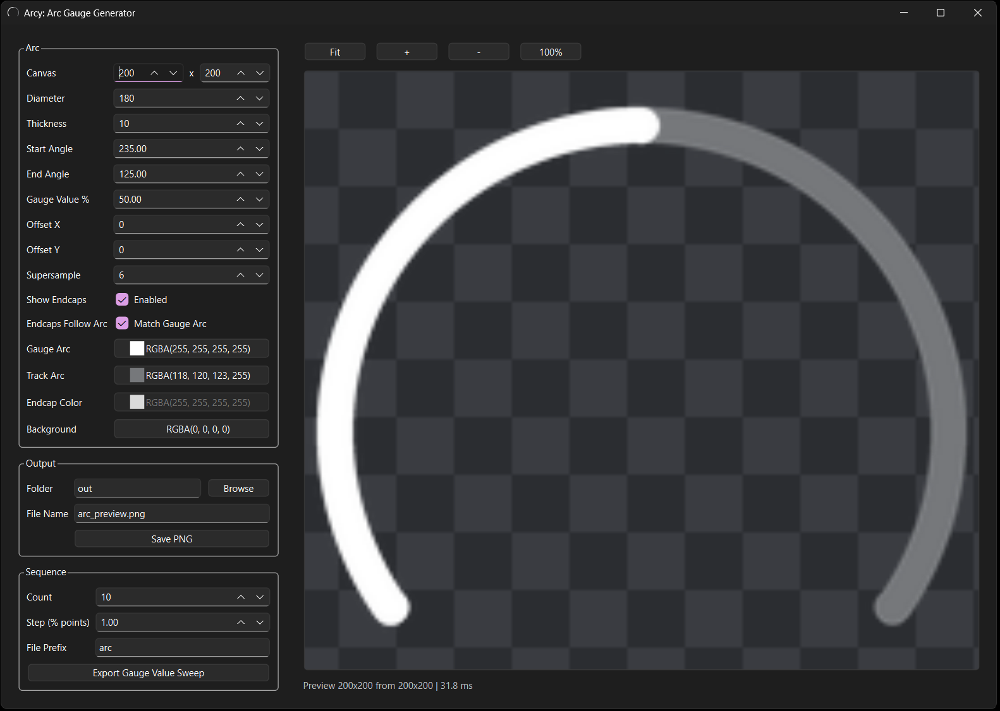

# Nextion Arc Gauge PNG Generator

Generate anti-aliased arc and radial gauge PNG assets for Nextion HMI displays.

This tool is designed for creators who need:

- smooth arc gauge images for Nextion projects
- layered gauge output (track + value arc)
- optional rounded endcaps
- PNG sequence export for animated gauge values
- a live PySide6 preview editor

## Keywords

Nextion, Nextion HMI, Nextion gauge, arc gauge, radial gauge, PNG generator, gauge image sequence, HMI asset generator.

## Preview UI



## Use It

### Options

* Download the appropriate executable from [Releases](../../releases)
* [Run as Python script](run-as-python-script)
* Bundle it using PyInstaller. You can use `build_script.py` to make it easy. Command is shown in [Build a Python Distributable](build-a-python-distributable)

## Build a Python Distributable

```shell
# Windows:
python.exe pkg.py Arcy src/ui2/main.py

# Unix:
python3 pkg.py Arcy src/ui2/main.py
```

## Run As Python Script

```shell
# First create a venv and install the dependencies.
# Windows
# TODO: Add PowerShell script for windows

# I've created a basic shell script to make this easy:
# Unix
./venv.sh
```

```shell
# Make sure to run in the activated venv created in the step above.
python src/ui2/main.py
```

## Third-Party Licenses

This project uses PySide6/Qt and other dependencies that are licensed separately from this repository's MIT license.

- Third-party notices: THIRD_PARTY_NOTICES.md
- Included license texts: licenses/LGPL-3.0.txt, licenses/GPL-2.0.txt, licenses/GPL-3.0.txt, licenses/Qt-GPL-exception-1.0.txt, licenses/LicenseRef-Qt-Commercial.txt
