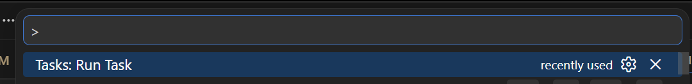
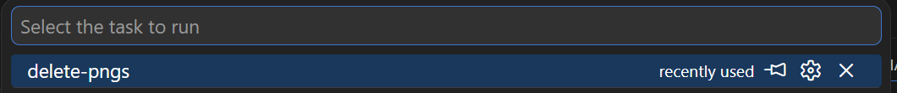

# arc-gauge-png-generator

* Generate PNG files to use in Nextion style displays

## How to use

* Simply run `src/main.py`, it will output the png files to the `out` folder.
* You can change the colors and sizes etc. in the `src/main.py` file
* If you're rerunning the creation, you can delete the old png files in `out` via the `delete-pngs` task

## Credits

- Give credit where credit is due...